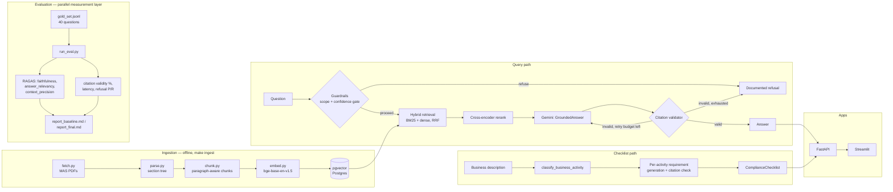

# Regulatory RAG + Compliance Agent


[](https://REPLACE_WITH_STREAMLIT_CLOUD_URL)

A citation-grounded question-answering and licensing-checklist agent over
public Singapore MAS (Monetary Authority of Singapore) financial regulation.
Every answer is either backed by a programmatically verified citation to a
specific document and clause, or the system refuses rather than guesses.

## Problem

Compliance teams at Singapore FinTechs manually cross-reference dozens of MAS
notices and guidelines every time they onboard a new product — is this a
Digital Payment Token Service? Does it need a DTSP licence on top of AML/CFT
obligations? Which notice's customer due diligence requirements actually
apply? That lookup is slow, repetitive, and error-prone precisely because it
requires holding several overlapping regulatory documents in your head at
once. This project is a technical demonstration of a system built to make
that lookup fast and auditable — grounded in real source text, not a
plausible-sounding hallucination.

**This is a technical demonstration, not a compliance product, and does not
constitute legal advice.**

## Architecture



## Key results

Measured live against all 40 gold-set questions, the real ingested 9-document
MAS corpus, and real Gemini free-tier calls — see `docs/eval/report_final.md`
for the full write-up and `docs/eval/baseline_vs_final.png` for the chart.

| Metric | Baseline (dense-only) | Final (hybrid + rerank) | Δ |
|---|---|---|---|
| Faithfulness (RAGAS) | 0.27 | 0.33 | +0.06 |
| Context precision (RAGAS) | 0.03 | 0.33 | **+0.31** |
| Answer relevancy (RAGAS) | 0.12 | 0.26 | +0.14 |
| Citation validity % (programmatic) | 100.00% | 100.00% | +0.00% |
| Refusal precision / recall | 0.42 / 0.87 | 0.45 / 0.93 | +0.03 / +0.07 |
| Retrieval latency p50 / p95 | 2,922 ms / 46,368 ms | 3,494 ms / 43,634 ms | +573 ms / -2,734 ms |

**Read this honestly, not as a highlight reel:** `citation_validity_pct` is a
hard, deterministic code check (see `services/citation/validator.py`) — every
citation either matches real retrieved source text or it doesn't — and it's
100% in both configs, which is the number this project's core guarantee
actually rests on. The RAGAS-judged metrics (faithfulness, context precision,
answer relevancy) are scored by `gemini-flash-lite-latest` — the smallest
free-tier Gemini model, used for both generation *and* judging — so treat
their exact values as directional, not precise. The one result worth trusting
without much hedging is **context precision improving 11x** (0.03 → 0.33):
that's a large, consistent gap that matches what hybrid retrieval + reranking
is supposed to do, and it's the concrete evidence behind
[ADR-0002](docs/adr/0002-hybrid-search-vs-dense-only.md)'s retrieval design.
Latency p95 is noisy in both directions — dominated by free-tier rate-limit
retry delays, not the retrieval algorithm itself.

## Tech stack

| Layer | Choice |
|---|---|
| LLM | Google Gemini (`gemini-flash-lite-latest`, free tier — see ADR-0004); Anthropic Claude supported as a config swap |
| Orchestration | LangChain + LangGraph |
| Retrieval | pgvector (dense) + BM25 (`rank_bm25`) + Reciprocal Rank Fusion + cross-encoder rerank |
| Embeddings | `BAAI/bge-base-en-v1.5` (local, no API key — see ADR-0003) |
| Structured output | Pydantic, via LangChain `with_structured_output` |
| Evaluation | RAGAS, hand-built 40-question gold set |
| Backend | FastAPI, `slowapi` rate limiting |
| Frontend | Streamlit |
| Database | Postgres + pgvector |
| CI/CD | GitHub Actions, CodeQL, Dependabot |
| Deployment | Fly.io (API) + Supabase (Postgres/pgvector) + Streamlit Community Cloud (frontend) |

## How to run

```bash
git clone <this-repo>
cd regulatory-rag
cp .env.example .env      # then set GEMINI_API_KEY (free, no card — aistudio.google.com/apikey)
docker compose up --build # ~1-2 min first build; brings up db + api + frontend
```

Once containers are healthy, populate the corpus (one-time, ~2-5 min
depending on network speed and local embedding inference):

```bash
make ingest
```

Then open the Streamlit app at `http://localhost:8501`. The FastAPI docs are
at `http://localhost:8000/docs`.

To run the evaluation harness and regenerate `docs/eval/report_*.md`:

```bash
make eval
```

## Screenshots

*To be added: chat with citations, checklist output, a correctly-refused
out-of-scope question side-by-side with a correctly-answered in-scope
question, and the eval report chart — see `docs/eval/baseline_vs_final.png`
once generated.*

## Corpus & data disclaimer

All source documents are public MAS / Singapore-government regulatory
publications, fetched from official `mas.gov.sg` / `sso.agc.gov.sg` URLs at
ingestion time (see `corpus/manifest.yaml`): the Technology Risk Management
Guidelines, Notices PSN01/PSN02/PSN07 and the Guidelines to PSN02, the FEAT
principles, the Guidelines on Licensing for Digital Token Service Providers,
the Project MindForge Phase-1 whitepaper, and the Payment Services Act 2019.
No production or personal data is used anywhere in this repository. This
project is a technical demonstration, not a compliance product, and does not
constitute legal advice.

## Evaluation methodology

A hand-built 40-question gold set (`docs/eval/gold_set.jsonl` — 15 factual,
10 multi-hop, 10 out-of-scope/refusal, 5 ambiguous) is scored with RAGAS
(faithfulness, answer_relevancy, context_precision) plus custom
code-computed metrics RAGAS doesn't cover: programmatic citation validity %,
retrieval latency percentiles, and refusal precision/recall. Two retrieval
configs are compared — `baseline` (dense-only, no rerank) and `final`
(hybrid BM25+dense with RRF, cross-encoder rerank, citation-validator
retry-then-refuse) — see `docs/eval/report_final.md` for the full
baseline-vs-final write-up and `docs/eval/gold_set.README.md` for a note on
gold-set citation provenance.

## Guardrails & hallucination mitigation

Two independent gates decide whether a question gets a full retrieval +
generation cycle or an immediate documented refusal: a scope pre-check
(is this plausibly a MAS-regulation question at all?) and a retrieval
confidence gate (did anything retrieved clear the rerank-score threshold?).
On top of that, every citation the LLM returns is checked programmatically
against the chunks actually retrieved for that query — not prompted into
compliance, verified — with one bounded retry before falling back to an
explicit refusal. See `services/citation/validator.py` and
`services/agent/guardrails.py`, and the refusal precision/recall numbers in
`docs/eval/report_final.md`.

## Architecture decisions

See [`docs/adr/`](docs/adr/) for the reasoning behind:
- [0001 — pgvector vs Chroma](docs/adr/0001-vector-store-pgvector-vs-chroma.md)
- [0002 — hybrid search vs dense-only retrieval](docs/adr/0002-hybrid-search-vs-dense-only.md)
- [0003 — local vs paid-API embeddings](docs/adr/0003-embedding-model-local-vs-api.md)
- [0004 — Gemini free tier vs paid Anthropic/OpenAI](docs/adr/0004-llm-provider-gemini-free-tier.md)

## What's next

- React frontend (Streamlit was chosen to protect the 2-3 week MVP time
  budget for retrieval quality and eval rigor — see ADR discussion).
- Larger corpus (more MAS notices/guidelines, more jurisdictions).
- Fine-tuned or larger reranker if `context_precision` plateaus.
- Expand the gold set beyond 40 questions as real usage surfaces edge cases.

## License

MIT (see `LICENSE`). Regulatory source text belongs to MAS / the Singapore
government; this repository only stores derived chunks/metadata for
technical-demonstration purposes.
